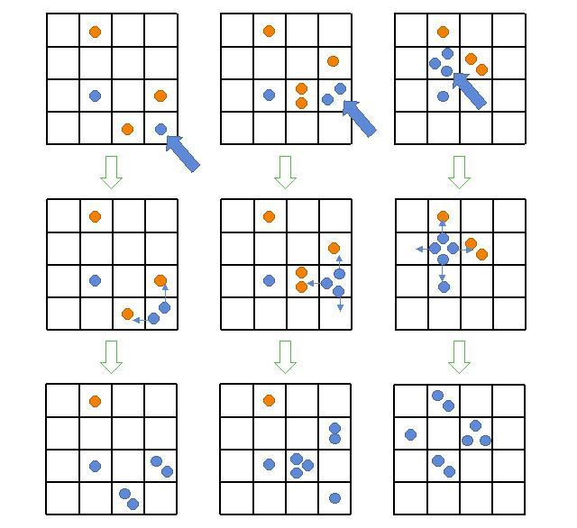
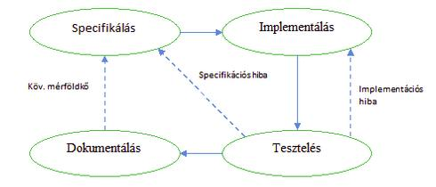

# atomic

##A játék leírása

A játékot 2 vagy több játékos játssza, egy ­– kezdetben üres – négyzetrácsos táblán. A játékosok felváltva tesznek egy-egy követ valamely mezőre. Ha a játékos üres mezőre tesz egy követ, azt a mezőt elfoglalja. Minden játékos csak üres mezőre, vagy az általa elfoglalt mezőre tehet követ. Ha a mező telítődik, a rajta lévő kövek szétszóródnak a szomszédos mezőkre, a helyükön üres mező marad. Egy mező akkor telítődik, ha az utolsó követ ráhelyezve, a rajta lévő kövek száma megegyezik a szomszédos mezők számával. (Tehát a tábla sarkaiban 2, a tábla szélein 3, a közepén pedig 4 kő telíti a mezőt) A szétszóródó kövek a szomszédos mezőket elfoglalják, a rajtuk lévő kövekhez hozzáadódnak, és a mezőt korábban birtokló játékostól az aktuális játékos birtokába kerülnek. Az a játékos aki ilyen módon az összes mezőjét elveszíti, kiesik. Az utolsóként játékban maradó játékos nyer.

##Mérföldkövek

1. Első verzió a következő funkcionalitással:
	1. 2 játékos
	2. Felhasználói felület: swing
	3. kötött táblaméret 
	4. Kövek reprezentálása grafikus elemekkel
	5. Reset (A játék bármikor újrakezdhető)

2. Kiegészítés tetszőlegesen beállítható táblamérettel
	1. Mechanizmus implementálása játékállás mentésére, illetve betöltésére 

3. Bővítés kettőnél több játékosra
	1. Játékosok számának megadása kezdéskor
	2. Játékosok színeinek megadása
	3. Játékosok nevének megadása

4. Kövek reprezentálása bitképpel (Ha még lesz idő)

5. Játék lokális hálózaton (Ha még lesz idő)
	1. Mentés illetve betöltés hálózati játék esetén
	2. Chat funkció hálózaton

##Mérföldkövek megvalósítása
Az egyes mérföldkövek megvalósítása a következő lépésekben (minden java osztályra):

1. Specifikálás: Csomagstruktúra, interfészek, osztály skeletonok létrehozása, doc kommentek kitöltése
2. Implementálás: Funkciók implementálása doc kommentek alapján
3. Tesztelés (Talán JUnit):
	1. Újrafelhasználható blackbox unit tesztek implementálása, futtatása
	2. Csomagszintű követelményteszt implementálása, futtatása
4. Dokumentálás: HTML referencia kigenerálása (javadoc)

